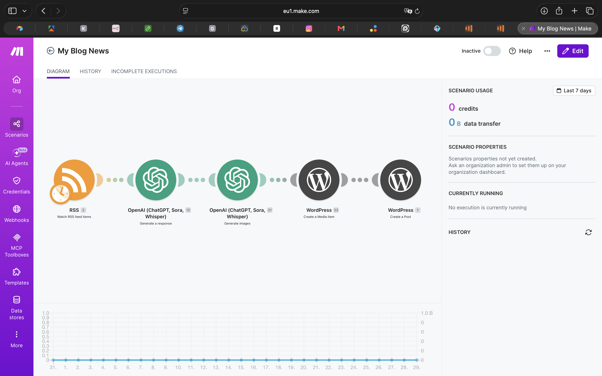

# AI WordPress Publisher

AI WordPress Publisher is an automation project for turning selected content inputs into WordPress drafts or published posts. The workflow combines RSS or structured content sources, OpenAI, image generation, and WordPress REST API integration through n8n or Make.com.

## Business Problem

Publishing content to WordPress usually involves several repetitive steps. A user collects source material, writes or adapts an article, prepares a title and excerpt, formats the post, selects a category, creates or uploads an image, and finally creates the WordPress post. Even when editorial judgment is still required, these operational steps take time.

Manual publishing also introduces inconsistency. Posts can miss metadata, use inconsistent formatting, duplicate source material, or remain outside the CMS until someone uploads them. For small content operations, this slows down publishing and makes the workflow harder to control.

## Solution

This project automates the mechanical publishing pipeline while preserving the option for human review. The workflow monitors selected inputs such as RSS feeds or content records, filters items, generates a structured article draft with OpenAI, prepares metadata, creates or attaches an image, and sends the result to WordPress.

The system can be configured to create drafts instead of publishing automatically. This is important for editorial quality and compliance. AI assists with content preparation, but the workflow is designed so that review and approval can remain part of the publishing process.

## Architecture

```text
RSS / Content Source
  ↓
Filter and Deduplication
  ↓
Make.com / n8n
  ↓
OpenAI
  ↓
Image Generation
  ↓
WordPress REST API
  ↓
Draft or Published Post
```

## Workflow

1. The automation checks an RSS feed or structured content source.
2. New items are compared against previously processed records to avoid duplicates.
3. Filtering logic decides whether the item should become a WordPress draft.
4. The workflow sends the selected source material to OpenAI with article structure instructions.
5. OpenAI returns a draft, title, excerpt, tags, and category suggestions.
6. The article is formatted for WordPress using clean HTML or block-compatible content.
7. An image prompt is generated from the article topic.
8. A generated image or prepared asset is uploaded to WordPress media library.
9. The workflow creates a WordPress post through the REST API.
10. The post is saved as a draft, scheduled item, or published post depending on configuration.
11. The source record is updated with the WordPress post ID and processing status.
12. Failed steps are logged for manual review.

## Technologies

| Technology | Purpose |
| --- | --- |
| RSS | Content input source |
| OpenAI | Draft generation and metadata preparation |
| WordPress REST API | Post and media publishing |
| Make.com / n8n | Workflow orchestration |
| Image Generation | Featured image creation |
| HTTP Requests | API integration |

## Features

- RSS or structured source ingestion
- Duplicate detection before generation
- AI-assisted article drafting
- Automated title, excerpt, and metadata preparation
- Featured image generation workflow
- WordPress media upload
- Draft-first publishing mode
- Error handling for incomplete content or failed API calls

## Business Value

The workflow reduces the amount of manual work required to prepare WordPress posts. It improves consistency by applying the same formatting, metadata, and publishing rules to every processed item.

The main value is operational speed with editorial control. Teams can use AI to create first drafts and structured CMS entries, while humans remain responsible for final approval. This makes the publishing process more reliable without depending on fully autonomous content release.

## Future Improvements

- Add Airtable or Google Sheets approval queue
- Include SEO metadata generation
- Add internal link suggestions
- Support multiple article templates
- Add automatic category mapping
- Create alerts for failed publishing attempts
- Add scheduled publishing rules by content type

## Repository Structure

```text
AI-WordPress-Publisher/
├── README.md
├── assets/
│   └── workflow.png
└── workflows/
    └── workflow.json
```

## Screenshot



## Export

The workflow export is located inside:

```text
workflows/workflow.json
```

